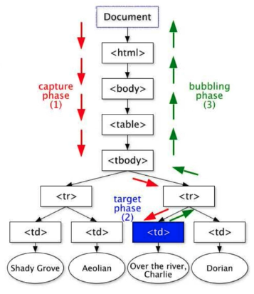

# Events

|  |  |
| :--- | :--- |
| [.addEventListener\(\)](https://developer.mozilla.org/en-US/docs/Web/API/EventTarget/addEventListener) | 'load', {capture: true} |
| .preventDefault\(\) |  |
| .forEach\(\) |  |
| .stopPropogation\(\) |  |

