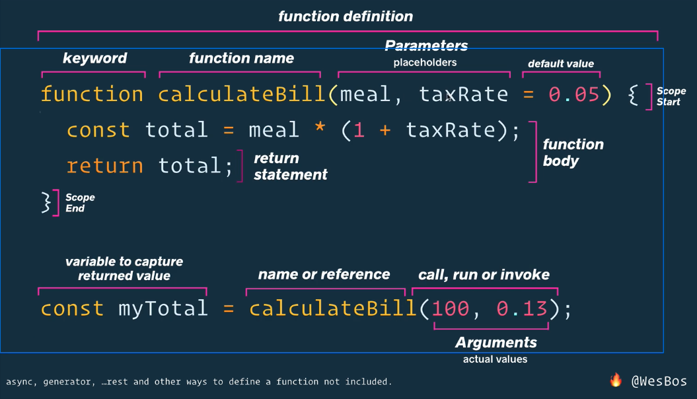

# Functions

### Articles

|  |  |
| :--- | :--- |
| [I never understood JavaScript closures](http://pop.frontendweekly.co/ZZDFJ3?utm_campaign=Frontend%2BWeekly&utm_medium=email&utm_source=Frontend_Weekly_193) | 3/11 |
| [How to impress interviewers by using recursion in JavaScript with ES6 features](https://medium.com/free-code-camp/how-to-impress-interviewers-by-using-recursion-in-javascript-with-es6-features-a14c763110d7) | 3/5 |
| [What is hoisting in vanilla JavaScript?](https://gomakethings.com/what-is-hoisting-in-vanilla-javascript/?mc_cid=1303dffebc&mc_eid=e9174ba77f) | 1/22/2020 |
| [Callbacks in JavaScript](https://zellwk.com/blog/callbacks/?ck_subscriber_id=420572458) | 1/8/2020 |
| [Arrow function](https://developer.mozilla.org/en-US/docs/Web/JavaScript/Reference/Functions/Arrow_functions) |  |

### Methods

|  |  |
| :--- | :--- |
| [.apply\(\)](https://developer.mozilla.org/en-US/docs/Web/JavaScript/Reference/Global_Objects/Function/apply) | The **`apply()`** method calls a function with a given `this` value, and `arguments` provided as an array \(or an [array-like object](https://developer.mozilla.org/en-US/docs/Web/JavaScript/Guide/Indexed_collections#Working_with_array-like_objects)\).  |
| [.bind\(\)](https://developer.mozilla.org/en-US/docs/Web/JavaScript/Reference/Global_Objects/Function/bind) | returns copy of function where `this` is set to the first argument passed into `.bind()` |
| [.call\(\)](https://developer.mozilla.org/en-US/docs/Web/JavaScript/Reference/Global_Objects/Function/call) | The **`call()`** method calls a function with a given `this` value and arguments provided individually. |

### `Hoisting` 

variable declarations  && function declaration, `hoisted` or moved to the top of the file

### `Closure`

A **closure** is the combination of a function bundled together \(enclosed\) with references to its surrounding state \(the **lexical environment**\). In other words, a closure gives you access to an outer function’s scope from an inner function. In JavaScript, closures are created every time a function is created, at function creation time.




```javascript
function functionName(parameter = 'default value') { //scope start
  const functionBody = 'do something';
  return functionBody; //return statement
} //end scope

const capturedVal = functionName(0, arguments);
```


### Function types


```javascript
function doctorize(firstName) {
  return `Dr. ${firstName}`;
}
```



```javascript
function (firstName) {
  return `Dr. ${firstName}`;
}
```



```javascript
const doctorize = function (firstName) {
  return `Dr. ${firstName}`;
}
```



```javascript
const inchesToCM = inches => inches *2.54;

//function inchToCM(inches) {
// const cm = inches * 2.54;
// return cm;
//}
```



```javascript
(function() {
  console.log('Running the Anon function');
return;
})();
```



```javascript
const wes = {
  name: 'Wes Bos',
  //Method!
  sayHi: function() {
    console.log('Hey Wes');
    return 'Hey Wes';
  },
  //Shorthand method
  yellHi() {
    console.log('HEY WESSSSS');
  },
  //arrow function
  whisperHi: () => {
    console.log('heeyyy wess');
  }
}
```



```javascript
//Click Callback
const button = document.querySelector('.clickMe');

function handleClick() {
  console.log('Great Clicking!!!');
}

button.addEventListener('click', handleClick);

//Timer Callback
setTimeout(function() {
  console.log('DONE! Time to eat!!');
}, 1000);
```



```javascript
async function go() {
  const pizza = await makePizza(['pineapple']).catch(handleDisgustingPizza);
  return pizza;
}
 // catch it at run time
go().catch(handleError);
// make a safe function with a HOF
function makeSafe(fn, errorHandler) {
  return function () {
    fn().catch(errorHandler)
  }
}

const safeGo = makeSafe(go, handleError);

safeGo();
```


