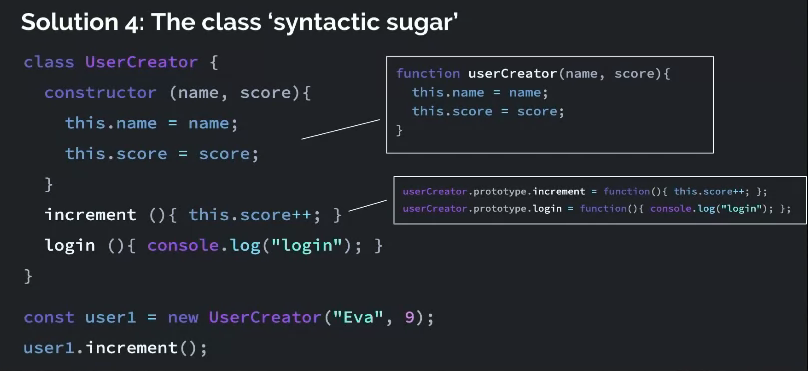

# Objects

### 2021

|  |  |
| :--- | :--- |
| [Object property shorthand values with vanilla JS](https://gomakethings.com/object-property-shorthand-values-with-vanilla-js/) | 2/23 |
| [Destructuring function parameters with vanilla JS for better developer ergonomics](https://gomakethings.com/destructuring-function-parameters-with-vanilla-js-for-better-developer-ergonomics/) | 2/22 |
| [The Object.fromEntries\(\) method in vanilla JS](https://gomakethings.com/the-object.fromentries-method-in-vanilla-js/) | 1/30 |
| [How to use the Map\(\) object in vanilla JS](https://gomakethings.com/how-to-use-the-map-object-in-vanilla-js/) | 1/25 |
| [Destructing in vanilla JS](https://gomakethings.com/destructing-in-vanilla-js/) | 1/20 |
| [The spread syntax operator in vanilla JS](https://gomakethings.com/the-spread-syntax-operator-in-vanilla-js/) | 1/19 |

### Articles 2020

|  |  |
| :--- | :--- |
| [How to get the index of an object in an array with vanilla JS](https://gomakethings.com/how-to-get-the-index-of-an-object-in-an-array-with-vanilla-js/) | 11/23 |
| [How to check if an object has a property](https://gomakethings.com/how-to-check-if-an-object-has-a-property/?mc_cid=ef4f2f4240&mc_eid=[UNIQID]) | 6/13 |
| [How to serialize form data into an object with vanilla JS](https://gomakethings.com/how-to-serialize-form-data-into-an-object-with-vanilla-js/?mc_cid=9ab46505a4&mc_eid=[UNIQID]) | 5/18  |
| [How JavaScript Implements Object Oriented Programming](https://www.freecodecamp.org/news/how-javascript-implements-oop/) | 2/19 |
| [Converting an object into an array with vanilla JS](https://gomakethings.com/converting-an-object-into-an-array-with-vanilla-js/?mc_cid=88c72ee7ee&mc_eid=e9174ba77f) | 2/4 |

```javascript
//object literaly syntax
const person = {
age: 100,
name: 'John',
sayHello: function (greeting = 'Hey') {
 return `${greeting} ${this.name}`;
}
}

//longer notation, not used because literal is cleaner
const person = new Object ({
age: 100,
name: 'John',
});

//to access properties use dot notation or square bracket
console.log(person.age);
console.log(person['age']); //can reference property using a variable by removing ''

//method shorthand
sayHello (greeting = 'Hey') {
 return `${greeting} ${this.name}`;
}
```

```javascript
const person1 = {
      first: 'John',
      last: 'Doe',
    };

//spread operator, creates a shallow copy of the object instead of reference it
const person3 = { ...person1 };

Object.assign({}, person1); //old way to copy object
```


```javascript
//prototype chain
function userCreator(name, score) {
  //const newUser = Object.create(functionStore);
  /* newUser */ this.name = name;
  /* newUser */ this.score = score;
  //return newUser;
};

/* functionStore */ this.prototype // {};
/* functionStore */ this.prototype.increment = function() {
  this.score++;
}

//new keyword automates two things
//1. create new user object. 
//2. Return the new user object
const user1 = new userCreator("Eva", 9)
```



```javascript
//class syntactic sugar
class UserCreator {
constructor (name, score) {
this.name = name;
this.score = score;
}
increment() {this.score++;}
login() { console.log("login"); }
}

const user1 = new UserCreator("Eva", 9);
user1.increment();
```




this

class {}

Prototypes

OO vs. OLOO

|  |  |
| :--- | :--- |
| [constructor](https://developer.mozilla.org/en-US/docs/Web/JavaScript/Reference/Global_Objects/Object/constructor) | The constructor property returns a reference to the Object constructor function that created the instance object. Note that the value of this property is a reference to the function itself, not a string containing the function's name. The value is only read-only for primitive values such as 1, true and "test". |
| [enumerable](https://developer.mozilla.org/en-US/docs/Web/JavaScript/Enumerability_and_ownership_of_properties) | **Enumerable** Properties in **JavaScript**. **Enumerable** properties are properties whose internal **enumerable** flag set to true. **Enumerable** simply means "countable", and with **JavaScript** objects, **enumerable** properties are those we are typically interested in when iterating over properties. |
| [Instance](https://developer.mozilla.org/en-US/docs/Glossary/Instance) | An [object](https://developer.mozilla.org/en-US/docs/Glossary/object) created by a [constructor](https://developer.mozilla.org/en-US/docs/Glossary/constructor) is an instance of that constructor. In [object-oriented programming](https://en.wikipedia.org/wiki/Object-oriented_programming) \(OOP\), an **instance** is a concrete occurrence of any [object](https://en.wikipedia.org/wiki/Object_%28computer_science%29), existing usually during the [runtime](https://en.wikipedia.org/wiki/Run_time_%28program_lifecycle_phase%29) of a computer program. |
| [polymorphism](https://developer.mozilla.org/en-US/docs/Glossary/Polymorphism) | Polymorphism is the presentation of one interface for multiple data types. |
| [properties](https://developer.mozilla.org/en-US/docs/Web/JavaScript/Reference/Global_Objects/Object#Properties_of_the_Object_constructor) | **JavaScript Properties**. **Properties** are the values associated with a **JavaScript** object. A **JavaScript** object is a collection of unordered **properties**. **Properties** can usually be changed, added, and deleted, but some are read only. |

### Window object

|  |  |
| :--- | :--- |
| [.fromEntries\(\)](https://developer.mozilla.org/en-US/docs/Web/JavaScript/Reference/Global_Objects/Object/fromEntries) | The Object.fromEntries\(\) method transforms a list of key-value pairs into an object. |
| onclick |  |
| .scrollTo\(\) |  |
| .setInterval\(\) |  |
| .setTimeout\(\) |  |

